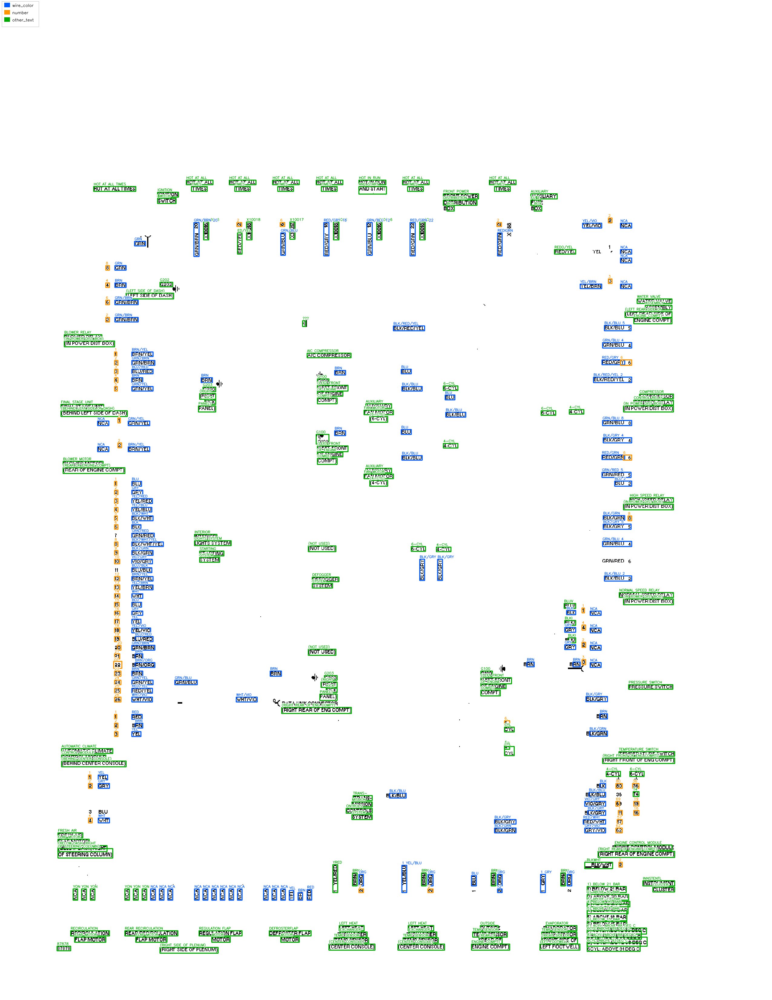

# Circuit Diagram Processing

The pipeline parses dense wiring diagrams by progressively removing and recording visual structures: page frame, sheet text, module rectangles, wires, endpoint objects, and OCR text. Its goal is to recover connection relationships and module-level information from complex diagrams, while producing smaller module crops that can be passed to downstream circuit-analysis tools.

The figures below use `bmw-328i-1997` page 1 to illustrate the processing flow. The `outputs/` directory includes results for pages 1-5 from three circuit sets: `bmw-328i-1997`, `honda-accord-1994`, and `mitsubishi-montero-sport-1997-1999`. The pipeline consists of `01_circuit.py` through `06_text.py`, followed by `vis.py`.

## Key challenge

  

    
    
A cleaner schematic-style example: visual primitives are relatively separated.

  

  

    
    
`bmw-328i-1997/page_001`: text, wires, boxes, connection dots, terminals, and symbols occupy the same large visual field.

  

Recognition is easier when components, wires, labels, and page metadata are already separated. In these pages, those primitives overlap heavily. A direct one-shot recognizer must solve layout, topology, OCR, and symbol separation at the same time.

## Main method

The method is based on computational geometry and OCR rather than large models or trained recognition networks for specific circuit components. It avoids recognizing every object from the original page in one pass. It first establishes page/circuit coordinates, then records or removes high-confidence structures in a fixed order. Each stage receives a cleaner image and structured JSON from previous stages, which makes connection extraction and module localization easier to verify.

The active processing order is:

1. `01_circuit.py`: locate page/circuit frame and split circuit content from sheet-level content.
2. `02_sheet_text.py`: OCR the outside-sheet/title region from `01_circuit/sheet_images`.
3. `03_rect.py`: detect module/component rectangles and export module crops.
4. `04_wire.py`: detect solid wires, diagonal extensions, dashed wire groups, and basic wire contacts.
5. `05_endpoint.py`: classify wire endpoints, infer endpoint-attached physical objects, and assign local net IDs.
6. `06_text.py`: run whole-page OCR on the cleaned endpoint image and erase only high-confidence text ink.
7. `vis.py`: combine `03_rect`, `04_wire`, `05_endpoint`, and `06_text` into final review JSON/images and copied module crops.

The workflow below uses the active 01-06+vis sequence. Tile splitting, large-model inference, and trained component-specific recognition networks are not part of these outputs.

# Pipeline

## Stage 01 - Circuit and sheet separation

  
  
`01_circuit`: detects the main circuit frame and creates both `circuit_images` and `sheet_images`.

Role: separate the dense circuit region from the surrounding sheet/title region. Goal: provide a stable page coordinate system and clean input images for downstream OCR, rectangle detection, and wire analysis.

## Stage 02 - Sheet text OCR

  
  
`02_sheet_text`: OCRs the sheet/title region rather than the dense circuit body.

Role: extract sheet-level text from the outside-sheet/title region rather than from the dense circuit body. Goal: record document metadata while keeping later circuit parsing focused on the circuit region.

## Stage 03 - Rectangle and module frames

  
  
`03_rect`: detects rectangular/module frames, writes masks, and exports `module_images` crops with borders erased.

Role: detect component, switch, and module frames before wire extraction. Goal: remove rectangular borders from the working image and export module crops that can be analyzed as smaller local circuit regions.

## Stage 04 - Solid and dashed wires

  
  
`04_wire`: detects solid wire seeds/extensions, diagonal extensions, dashed wire groups, and connection contacts from `03_rect/circuit_images`.

Role: detect wire geometry from the rectangle-cleaned circuit image, including solid wires, diagonal extensions, dashed wire groups, and basic contacts. Goal: convert visual line structures into normalized wire records for endpoint and net analysis.

## Stage 05 - Endpoints and local nets

  
  
`05_endpoint`: classifies endpoint states, infers endpoint-attached structures, and assigns local net IDs.

Role: classify wire endpoints and infer endpoint-attached physical structures from the wire and rectangle outputs. Goal: build local connectivity records while keeping distinct ground terminals and disconnected endpoints explicit.

## Stage 06 - Whole-page OCR and text erasure

  
  
`06_text`: detects page-level circuit text and erases high-confidence text ink from the endpoint-cleaned circuit image.

Role: run OCR on `05_endpoint/circuit_images` and categorize detections as wire color codes, numbers, or other text. Goal: preserve recognized text as structured data while removing high-confidence text ink from the image for downstream visual parsing.

## Final visualization - Combined review

  
  
`vis.py`: overlays recognized rectangles, wires, endpoint objects, and text on the `01_circuit` base image.

Role: combine the outputs from `03_rect`, `04_wire`, `05_endpoint`, and `06_text` into one review layer. Goal: provide a single visual and JSON representation for checking recognized rectangles, wires, endpoint objects, OCR text, and copied module crops without recomputing detection.

Color meanings in the `vis.py` combined review:

  
Rectangular/module frames

  
Solid wires

  
Dashed wire groups

  
Connection dots and arrow structures

  
Round terminal objects

  
Ground terminals

  
Small connected endpoint structures

  
Brace structures

  
Rectangle-frame suppression boundaries

  
OCR wire-color labels

  
OCR numbers

  
Other OCR text

The module crops are intended for downstream analysis. After the global page is decomposed into frames, wires, endpoints, nets, and text, each crop contains a smaller local circuit problem. Users can process these crops with tools designed for small-scale circuit recognition or component-level analysis.

# Results

The manually reviewed coverage check uses the first five pages from each of three circuit sets: `bmw-328i-1997`, `honda-accord-1994`, and `mitsubishi-montero-sport-1997-1999` (15 pages total). From visual inspection, recognized detections were almost all correct, so this table focuses on retrieval coverage: for each metric, the denominator is `recognized + manually observed missed`.

| Metric | BMW | Honda | Mitsubishi | Total |
|---|---:|---:|---:|---:|
| Box | 64 / 64 = **100.0%** | 76 / 79 = **96.2%** | 61 / 63 = **96.8%** | 201 / 206 = **97.6%** |
| Solid wire | 598 / 607 = **98.5%** | 461 / 471 = **97.9%** | 291 / 313 = **93.0%** | 1350 / 1391 = **97.1%** |
| Dash wire | 45 / 47 = **95.7%** | 53 / 64 = **82.8%** | 17 / 24 = **70.8%** | 115 / 135 = **85.2%** |

The box metric corresponds to `03_rect.py`. The solid-wire and dash-wire metrics correspond to `04_wire.py`; they are reported separately because solid wires and dashed wire groups are different visual primitives with different failure modes.

# Limitations

### 1. Rule and threshold dependence

The method relies on geometry rules: line length, side coverage, corner tolerance, wire width estimates, endpoint search radii, and OCR confidence thresholds. These settings work for the reviewed diagrams, but they need broader validation across other diagram families.

### 2. OCR and erasure sensitivity

`06_text.py` erases only high-confidence text ink to avoid damaging nearby wires. This conservative behavior reduces accidental wire damage, but it can leave low-confidence text residuals or miss labels when OCR quality drops.

# Final Summary

- The workflow is `01_circuit` -> `02_sheet_text` -> `03_rect` -> `04_wire` -> `05_endpoint` -> `06_text` -> `vis`.
- The pipeline extracts page regions, module frames, wires, endpoints, nets, and OCR text through staged image cleanup and JSON handoff.
- `vis.py` produces review images and combined JSON without recomputing detection.
- `vis/module_images` contains smaller module crops that can be passed to other small-scale circuit analysis tools.
- Remaining work includes broader validation, OCR cleanup, and endpoint/net ground truth evaluation.
