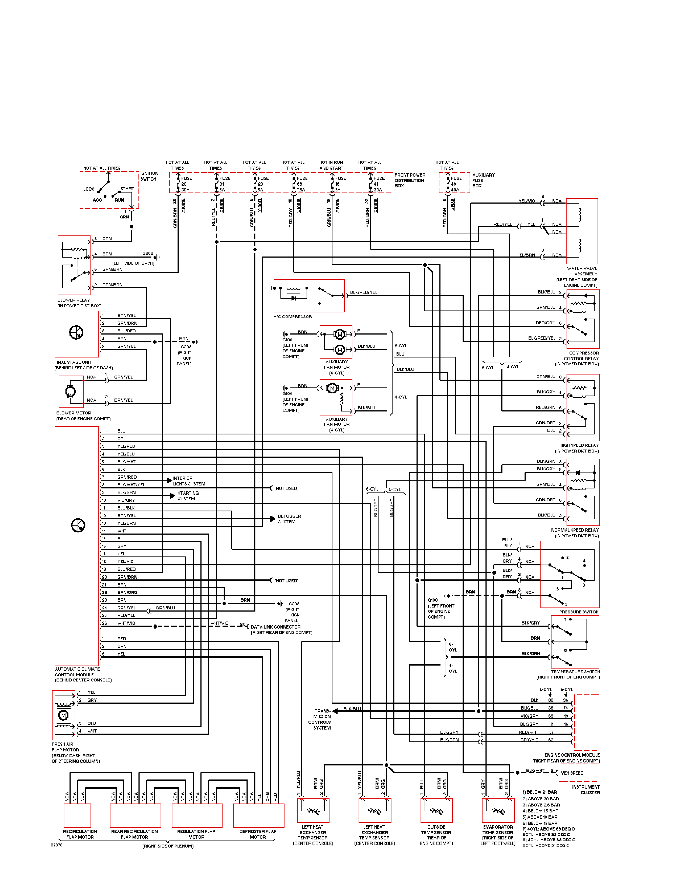
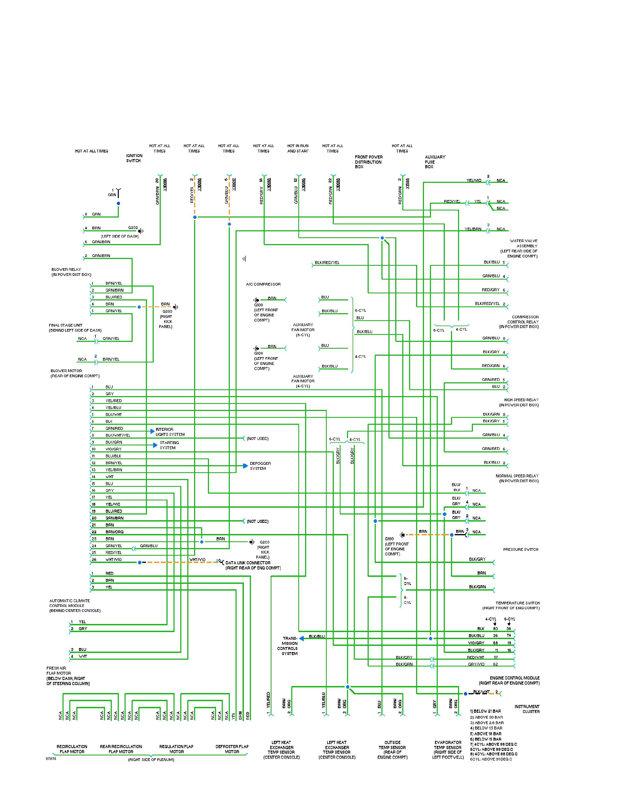
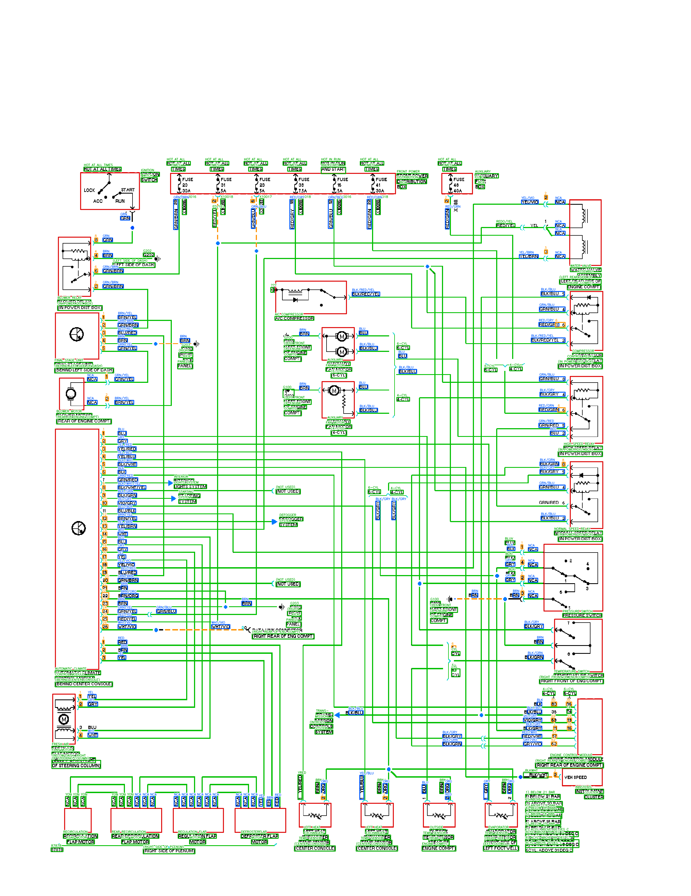
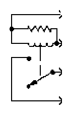
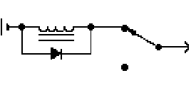

# Circuit Diagram Processing

The current pipeline parses dense automotive wiring diagrams by progressively removing and recording visual structures: page frame, sheet text, module rectangles, wires, endpoint objects, and OCR text. The final `vis.py` stage aggregates the recognized content into one review artifact.

The main case study here is `bmw-328i-1997`, pages 1-5, using the current artifacts under `outputs/`. The pipeline now consists of `01_circuit.py` through `06_text.py`, followed by `vis.py`.

## Why this is hard

  

    
    
A cleaner schematic-style example: visual primitives are relatively separated.

  

  

    
    
`bmw-328i-1997/page_001`: text, wires, boxes, connection dots, terminals, and symbols occupy the same large visual field.

  

Many recognition pipelines are easier when components, wires, labels, and page metadata are already isolated. In this benchmark, those primitives overlap heavily. A direct one-shot recognizer has to solve layout, topology, OCR, and symbol separation at the same time.

## Core idea: staged decomposition

The method does not try to recognize every circuit object from the original page at once. It first establishes page/circuit coordinates, then removes or records high-confidence structures in a deliberate order. Later stages operate on cleaner images and inherit structured JSON from earlier stages.

The active processing order is:

1. `01_circuit.py`: locate page/circuit frame and split circuit content from sheet-level content.
2. `02_sheet_text.py`: OCR the outside-sheet/title region from `01_circuit/sheet_images`.
3. `03_rect.py`: detect module/component rectangles and export module crops.
4. `04_wire.py`: detect solid wires, diagonal extensions, dashed wire groups, and basic wire contacts.
5. `05_endpoint.py`: classify wire endpoints, infer endpoint-attached physical objects, and assign local net IDs.
6. `06_text.py`: run whole-page OCR on the cleaned endpoint image and erase only high-confidence text ink.
7. `vis.py`: aggregate `03_rect`, `04_wire`, `05_endpoint`, and `06_text` into final review JSON/images and copied module crops.

This replaces the older 10-step narrative. There is no current tile-splitting stage and no current NN component-recognition stage in the active 01-06+vis flow.

# Current Pipeline

## Stage 01 - Circuit and sheet separation

  
  
`01_circuit`: detects the main circuit frame and creates both `circuit_images` and `sheet_images`.

This stage establishes the coordinate system for later work. For page 001, it finds one closed outer frame and outputs:

- `circuit_images/page_001.png`: the circuit region with page framing removed.
- `sheet_images/page_001.png`: the page-level title/sheet content outside the circuit frame.
- `json/page_001.json`: frame geometry, frame calibration, and image dimensions.

## Stage 02 - Sheet text OCR

  
  
`02_sheet_text`: OCRs the sheet/title region rather than the dense circuit body.

This stage consumes `01_circuit/sheet_images`. On page 001, it finds one OCR region and extracts three sheet/title strings: `SYSTEM WIRING DIAGRAMS`, `Air Conditioning Circuits`, and `1997 BMW 328i`.

## Stage 03 - Rectangle and module frames

  
  
`03_rect`: detects rectangular/module frames, writes masks, and exports `module_images` crops with borders erased.

This stage is intentionally separate from wire extraction. It finds component or switch border frames made from connected or near-connected axis-aligned sides. Its cleaned `circuit_images` become the input for wire detection.

For pages 1-5, the current BMW artifacts contain 64 rectangle/module frames. Page 001 contains 27 frames.

## Stage 04 - Solid and dashed wires

  
  
`04_wire`: detects solid wire seeds/extensions, diagonal extensions, dashed wire groups, and connection contacts from `03_rect/circuit_images`.

The wire stage consumes the rectangle-cleaned circuit image, not the raw page. Its JSON normalizes solid and dashed detections into `wires`, including centerline geometry, masks, type, and connection records.

For pages 1-5, the current BMW artifacts contain 643 wires total: 598 solid wires, 6 diagonal extensions, and 45 dashed wire groups. Page 001 contains 221 wires: 215 solid, 3 diagonal extensions, and 6 dashed groups.

## Stage 05 - Endpoints and local nets

  
  
`05_endpoint`: classifies endpoint states, infers endpoint-attached structures, and assigns local net IDs.

This stage consumes `03_rect/circuit_images`, `04_wire/json`, and `03_rect/json`. It suppresses rectangle-owned wires/dash groups, classifies connected and disconnected endpoints, records small endpoint-attached residual structures, and builds local net IDs without merging distinct GND terminals.

For pages 1-5, the current visual aggregate records 451 endpoint objects and 98 nets. Page 001 records 148 endpoint objects, 421 endpoint classification records, and 39 nets.

## Stage 06 - Whole-page OCR and text erasure

This is a major change from the older presentation: no tile-splitting stage exists in the current pipeline. OCR is run on `05_endpoint/circuit_images`. Detections are categorized as wire color codes, numbers, or other text. Only detections with OCR confidence at least `--erase-min-confidence` are erased, and erasure removes the text's ink pixels rather than the whole bounding box.

For pages 1-5, the current BMW artifacts contain 1122 text detections: 395 wire color labels, 222 numbers, and 505 other text detections. 1101 detections are erased. Page 001 contains 348 text detections, of which 339 are erased.

## Final visualization - Aggregate review

  
  
`vis.py`: overlays recognized rectangles, wires, endpoint objects, and text on the `01_circuit` base image.

`vis.py` is an aggregation and review layer. It does not recompute detection or connectivity. Its `images/page_NNN.png` output is the main visual review: a base `01_circuit` circuit image with overlays for recognized rectangles, wires, endpoint objects, and OCR text. It also copies the module crops from `03_rect/module_images` into `vis/module_images`, making the detected module regions easy to inspect as standalone local circuit images.

  

    
    
`vis/module_images/page_001/module_0005.png`: detected module crop carried forward by `vis.py`.

  

  

    
    
`vis/module_images/page_001/module_0006.png`: another page 001 module crop for local analysis.

  

These module crops are the bridge to the next phase. After the global page has been decomposed into frames, wires, endpoints, nets, and text, the key next problem is analyzing the circuit inside each module: recovering local internal connections, extracting component symbols, and linking those local component structures back to the page-level wiring graph.

# Current Results

Current aggregate counts for `bmw-328i-1997`, pages 1-5:

  
<strong>64</strong>rectangle/module frames

  
<strong>643</strong>wires

  
<strong>451</strong>endpoint objects

  
<strong>98</strong>local nets

  
<strong>1122</strong>text detections

Page 001 demonstrates the full representation shift: 27 rectangles, 221 wires, 148 endpoint objects, 39 nets, and 348 OCR text detections are collected into a single `vis/json/page_001.json` review record.

These are artifact counts from the current pipeline outputs, not accuracy or benchmark performance metrics.

# Current Limitations

### 1. Rule and threshold dependence

The method still relies heavily on geometry rules: line length, side coverage, corner tolerance, wire width estimates, endpoint search radii, and OCR confidence thresholds. These settings work as a controlled parsing strategy, but they need broader validation across other diagram families.

### 2. OCR and erasure sensitivity

`06_text.py` erases only high-confidence text ink to avoid damaging nearby wires. This conservative behavior is safer, but it can leave low-confidence text residuals or miss labels when OCR quality drops.

### 3. Endpoint and net validation

`05_endpoint.py` records connected/disconnected endpoint classifications and local nets, but these should still be validated against a ground-truth wiring graph before they are treated as final electrical connectivity.

### 4. Module-level circuit analysis is still the next key step

The current 01-06+vis pipeline exports module crops from `03_rect/module_images` and copies them into `vis/module_images`. The next key stage is not just classification of isolated symbols; it is module-level circuit parsing: internal wire analysis, component extraction, local connectivity recovery, and integration of each module's internal graph with the page-level nets. A trained component-recognition model can support this, but the active artifact set does not yet include quantitative module-level or NN evaluation.

# Final Summary

- The active workflow is now `01_circuit` -> `02_sheet_text` -> `03_rect` -> `04_wire` -> `05_endpoint` -> `06_text` -> `vis`.
- The pipeline no longer uses the older tile/OCR-rescue/component-candidate sequence in this presentation.
- `vis.py` is the final review and data aggregation layer: its `images` output combines recognized rectangles, wires, endpoint objects, nets, and text without recomputing detection.
- The module crops in `vis/module_images` define the next important work: module-internal circuit analysis and component extraction.
- The main remaining work is robustness validation, OCR cleanup, endpoint/net ground truth evaluation, and module-level parsing.
